# Performance Engineering Framework Architecture

## Overview

This document describes the architecture of the Production-Grade Performance Engineering Framework, which combines Playwright UI/API testing with k6 performance testing, integrated with observability and CI/CD.

---

## System Architecture

### High-Level Architecture Diagram

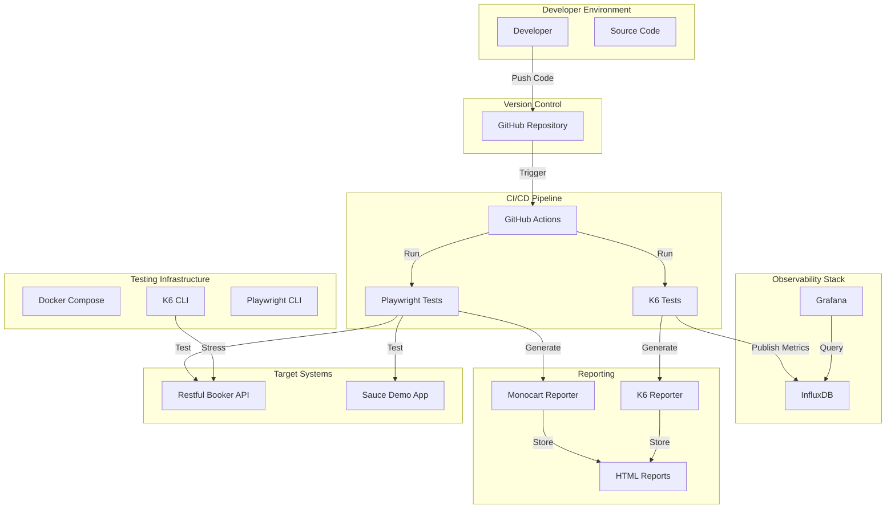

---

## Test Execution Pipeline

### Performance Testing Pipeline

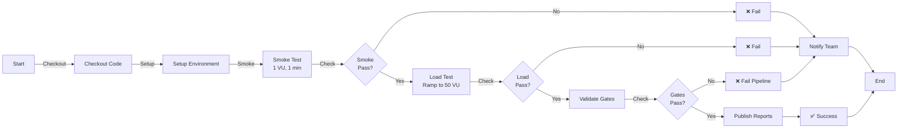

---

## Project Structure

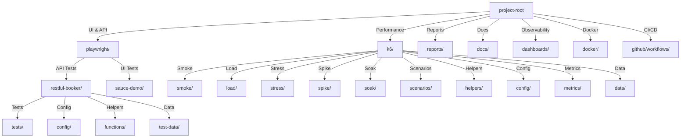

---

## Data Flow

### Test Execution Data Flow

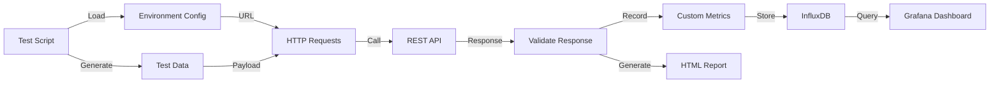

---

## Component Architecture

### K6 Test Framework Components

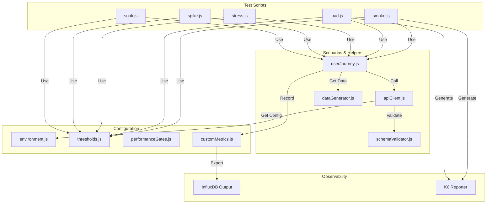

---

## API Client Layer Architecture

### Request/Response Lifecycle

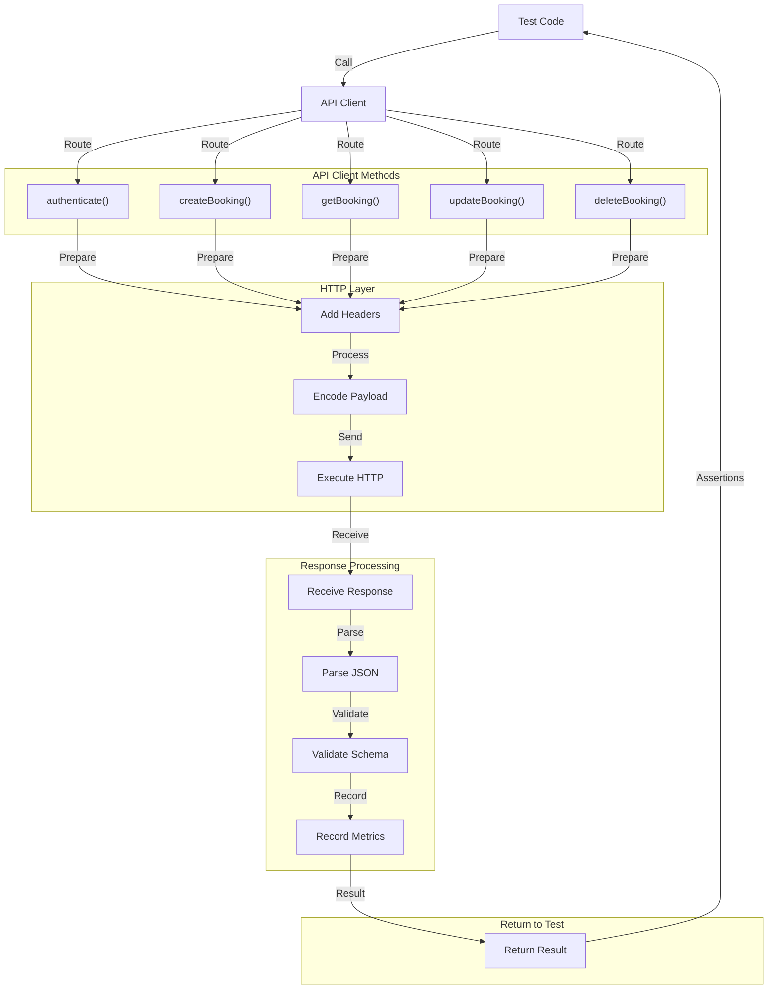

---

## Configuration Management

### Environment-Based Configuration

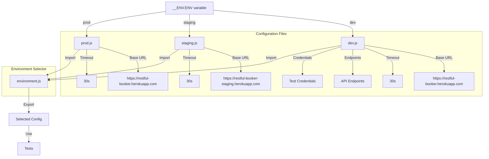

---

## Metrics & Observability Architecture

### Metrics Collection and Reporting

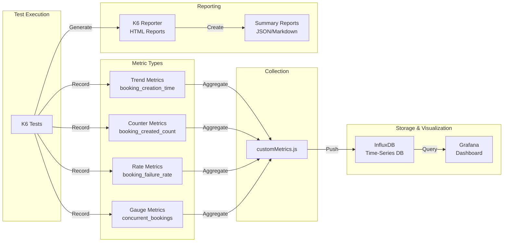

---

## CI/CD Integration

### GitHub Actions Workflow

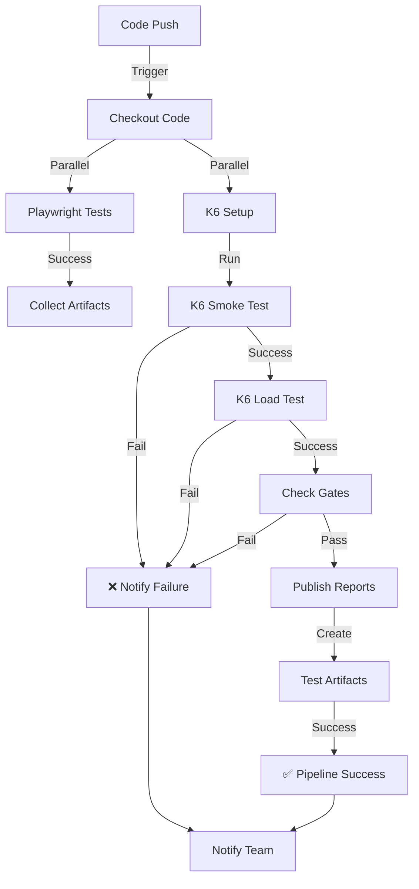

---

## Docker Architecture

### Docker Compose Stack

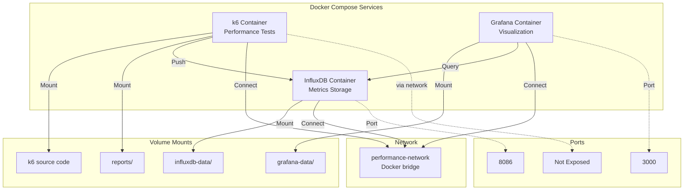

---

## Deployment Stages

### Test Execution Stages

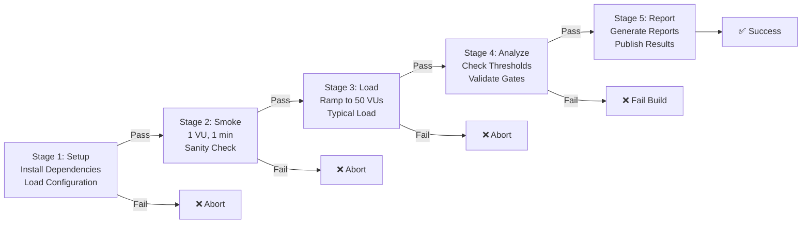

---

## Performance Test Types

### Test Type Characteristics

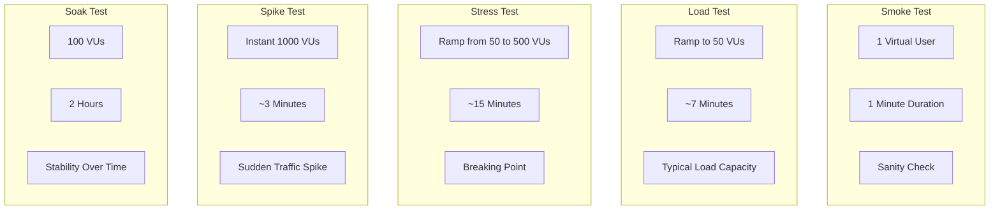

---

## Technology Stack

| Layer | Technology | Purpose |
|-------|-----------|---------|
| **UI Testing** | Playwright | Browser automation, UI tests |
| **API Testing** | Playwright, k6 | API functional & performance tests |
| **Performance Testing** | k6 | Load testing, spike testing, soak testing |
| **Configuration** | JavaScript | Environment-based config management |
| **Data Generation** | Custom JS | Realistic test data generation |
| **Metrics Storage** | InfluxDB | Time-series database for metrics |
| **Visualization** | Grafana | Real-time dashboards |
| **Reporting** | k6-reporter, Monocart | HTML reports |
| **CI/CD** | GitHub Actions | Automated test execution |
| **Containerization** | Docker | Isolated test environment |
| **Version Control** | Git | Source code management |

---

## Security Architecture

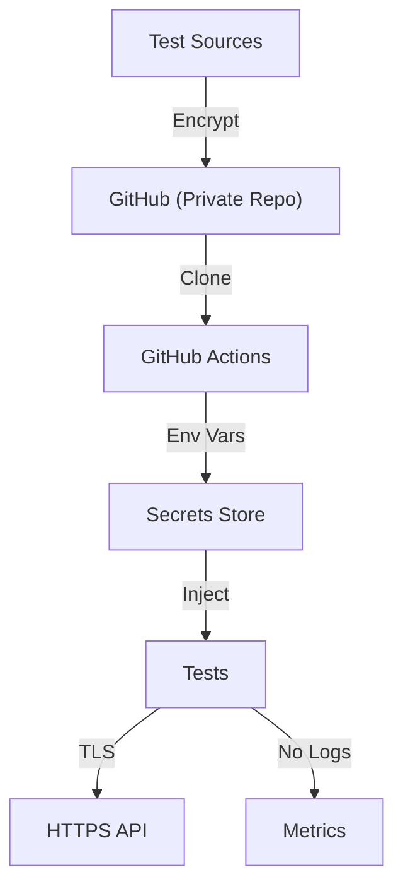

---

## Scalability Considerations

### Horizontal Scaling

- **K6 Cloud:** Distribute load across multiple cloud nodes
- **Docker:** Scale containers across Kubernetes cluster
- **Database:** Use InfluxDB Enterprise for high-volume metrics
- **Dashboards:** Multiple Grafana instances for concurrent users

### Performance Optimization

- Implement data retention policies in InfluxDB
- Use caching for frequently accessed metrics
- Compress old reports
- Parallelize test execution

---

## Monitoring & Alerting

### Key Metrics to Monitor

- HTTP response times (P50, P95, P99)
- Error rates by endpoint
- Throughput metrics
- Virtual user behavior
- Resource utilization

### Alert Thresholds

| Condition | Action |
|-----------|--------|
| P95 > 500ms | ⚠️ Warning |
| P95 > 1000ms | ❌ Critical |
| Error Rate > 1% | ❌ Critical |
| Error Rate > 5% | 🔴 Severe |

---

## Future Enhancements

1. **InfluxDB Cloud Integration** - Move to managed service
2. **K6 Cloud** - Distributed load testing
3. **Advanced Analytics** - ML-based anomaly detection
4. **Webhook Notifications** - Slack/Teams integration
5. **Performance Budgeting** - Track against budgets
6. **Tracing Integration** - OpenTelemetry support
7. **Mobile Performance** - Add mobile testing
8. **API Contract Testing** - Enhanced schema validation
